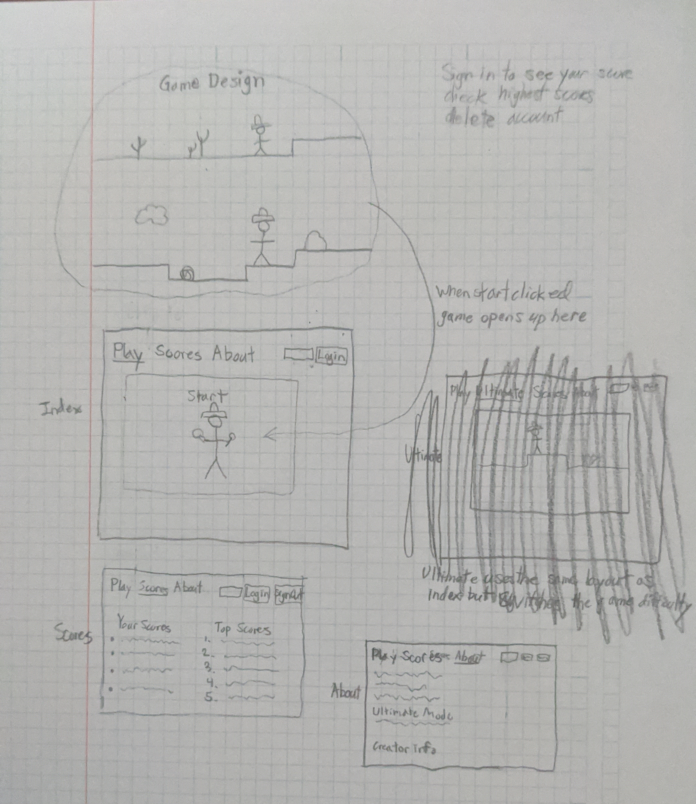
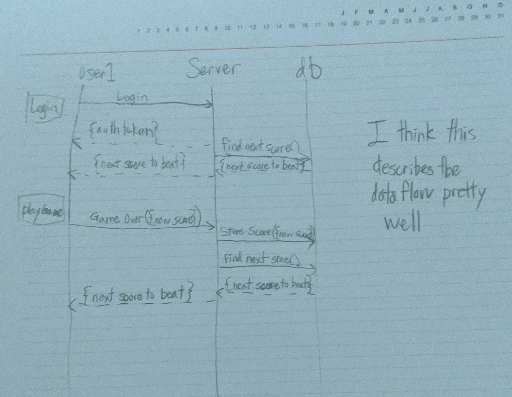

# StartUp

## Description Deliverable

### Elevator Pitch
This is going to be like the dino game that works on chrome, but better. The base level 
game is fun, but it lacks a few key elements that would make it great. This upgrade will be 
comparable to an ultimate mode of the game with more difficulty and obstacles. 
Besides having more content it will also be able to save a user's score and allow 
them to compare their score with others. The current game name is Raptor Run. 

### Design

This shows the design of the three pages that will be used with their relative layouts.

This shows aproximately what data moves from the user to server and what is stored in the database. 
This is even more of an approimation than the frontend design as much of this may change. 

### Key Features
- Secure login over HTTPS
- Start game and use player input to play in real time
- User can login and see their best scores
- User can also see the best scores of all time
- User can delete account and scores

### Technologies
I am going to use the required technologies in the following ways.

- HTML - Uses HTML structure for application. Three HTML pages. One for playing the game, one for looking at scores, and one with about info.
- CSS - Application styling that looks good on different screen sizes; use simple, but clear graphics and fonts; Design focuses user on the game.
- JavaScript - Provides the majority of the functionality and animations for the game. Also allows for clickable buttons on all pages. 
- Service - Back end service with endpoints for:
    - login
    - retrieving scores of the logged in person
    - retrieving the highest scores logged
- DB - Store users and scores in the database. Has a table for each user and a table with the highest scores.
- Login - Register and login users. Credentials securely stored in database. Cannot save score unless logged in. 
- WebSocket - When a user logs in they get a message of the current highest score and the highest score of the next person with a challenge to beat them. 
- React - Application will be ported to use the React web framework.

## HTML Deliverable
I built out the structure of my application using HTML.

- HTML pages - Four HTML pages that have a login page, game page, scores page, and about page.
- Links - The login page automatically links to the game page. Each page can also link to any of the other three from the links in the header. 
- Text - Text is used on the About page to describe the game and give instructions. 
- Images - Added a canvas image that will be used for the game, currently is blank without javascript. Added jpg of Mariachi to About page. 
- Login - Input box and submit button on the login page. Also is on the scores page.
- Database - There are two tables on the scores page one pulling the users data from the database and the other pulling the highest scores. 
- WebSocket - Added a stand in for the popup message that appears whenever the games page is opened telling the user what the next high score to beat is.
- Third Party - There is a photo on the opening page that when third party interactions are incorporated will switch every time it loads. 

## CS Deliverable
I added style to the pages with CSS.

- Added color into the pages
- Menu bar looks much better and is completely usable
- Formatting on all pages is better
- Fonts are consistent
- Used flex to make sure the page looks good on any screen. 

## JavaScript Deliverable
I added all sorts of functionality to the website with javascript.

- The game is made using javascript animations on a canvas
- All buttons are linked to functions
- Data is stored temporarily in the local storage and can be moved easily to a database in the future
- A person can enter info to login, none is stored persistently
- Functionality is present to implement websockets on the index page in the future
- My idea of getting a big game has shrunk quite a bit, and it is a lot more basic now

## Service Deliverable
I added service calls through Javascript

- The project uses Node.js and Express
- The homepage loads a random image each time it is loaded
- Top scores are stored in the servers memory instead of local storage

## DB Deliverable
I added backend connections that saves the highscores to a mongo database.

- Top scores are saved in database and are consistently updated

## Login Deliverable
I added login functionality that stores usernames in a mongo database.

- Users can sign in with a unique username and password
- Passwords are stored in a hashed format
- Each user gets a authToken cookie when they are signed in

## WebSocket Deliverable
I added Websocket functionality that allows users to recieve messages from other users through the server

- Each time a user start a game a notification is displayed
- Each time a user finishes their score is displayed

## React Deliverable
